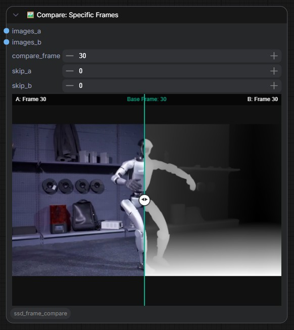

# 🖼️ Compare Specific Frames – ComfyUI Extension



**Compare Specific Frames** is a custom [ComfyUI](https://github.com/comfyanonymous/ComfyUI) extension designed for precise, frame-by-frame analysis of image sequences and video batches. It extracts specific frames from two different visual sequences and renders them in an interactive, wipe-style A/B comparison slider directly within the ComfyUI interface.

This tool is highly effective for evaluating the exact frame differences in video generation pipelines, upscaling results, or style transfers.

---

## 🚀 Features

* **Frontend Caching:** It caches the image batches directly in the browser. You can scrub through frame numbers and the UI updates instantly—no need to re-queue the prompt.
* **Offset Syncing:** It features a base `compare_frame` "playhead", plus `skip_a` and `skip_b` offsets. This allows you to perfectly sync up two videos that start at different times and scrub through them together.
* **Interactive Wipe Preview:** Click and drag the horizontal slider on the node to seamlessly compare the two isolated frames.
* **Nodes 2.0 Compatible:** Fully updated to work seamlessly with ComfyUI's new Vue-based frontend.

---

## 📦 Installation

1. Navigate to your ComfyUI `custom_nodes` directory.
2. Create a folder named `frame_comparer` (or clone this repository if hosted on Git).
3. Ensure the directory structure exactly matches the following:

```text
ComfyUI/
└── custom_nodes/
    └── frame_comparer/
        ├── README.md             <-- (This file)
        ├── node.jpg              <-- (Preview Image)
        ├── __init__.py           <-- (Node registration)
        ├── compare_frames.py     <-- (Backend logic)
        └── web/
            └── compare_frames.js <-- (Frontend slider UI)